# uecs-hardwares — ArSprout拡張ハードウェア集

**ArSprout / UECS環境に追加できる** センサーノード・リレーノードの  
ファームウェアとドライバをまとめたリポジトリ。

既存のArSproutネットワーク（UECS-CCM UDP multicast）にそのまま参加でき、  
ArSprout側の設定変更は不要。PCやRaspberry Piなしで単体動作する。

---

## アーキテクチャ

```mermaid
flowchart TD

subgraph group_embedded["Embedded firmware"]
  node_ccm_fw["CCM relay<br/>Arduino firmware"]
  node_mqtt_fw["MQTT relay<br/>Arduino firmware<br/>[rp2350_relay.ino]"]
  node_standalone_fw["Standalone ctrl<br/>Arduino firmware"]
  node_sensor_registry_fw["Sensor registry<br/>embedded sensor map<br/>[sensor_registry.h]"]
  node_watchdog_fw["Watchdog<br/>embedded safety<br/>[sw_watchdog.h]"]
  node_rule_engine["Rule engine<br/>embedded control<br/>[rule_engine.h]"]
  node_scheduler["Scheduler<br/>embedded timing<br/>[scheduler.h]"]
  node_event_log["Event log<br/>embedded logging<br/>[event_log.h]"]
  node_web_ui_fw["Web UI<br/>embedded ui<br/>[web_ui.h]"]
end

subgraph group_host["Host daemon"]
  node_daemon_main["Daemon main<br/>python service<br/>[main.py]"]
  node_ccm_receiver["CCM receiver<br/>python network<br/>[ccm_receiver.py]"]
  node_sensor_loop["Sensor loop<br/>python polling<br/>[sensor_loop.py]"]
  node_gpio_watch["GPIO watch<br/>python io<br/>[gpio_watch.py]"]
  node_ds18b20["DS18B20<br/>python sensor<br/>[ds18b20.py]"]
  node_wh65lp["WH65LP reader<br/>python sensor<br/>[wh65lp_reader.py]"]
  node_i2c_relay["I2C relay<br/>python actuator<br/>[i2c_relay.py]"]
  node_emergency["Emergency override<br/>python safety"]
  node_mqtt_bridge["MQTT bridge<br/>python integration"]
  node_rest_api["REST API<br/>python api<br/>[rest_api.py]"]
end

subgraph group_hardware["Hardware design"]
  node_kicad_design["KiCad flow<br/>pcb tooling<br/>[DESIGN.md]"]
  node_actuator_board["Actuator board<br/>pcb design"]
  node_grove_shield["Grove shield<br/>pcb design"]
  node_fab_exports["Fab exports<br/>manufacturing output"]
end

subgraph group_ops["Deployment"]
  node_docker_stack["Docker stack<br/>deployment"]
  node_mosquitto["Mosquitto<br/>broker config<br/>[mosquitto.conf]"]
  node_systemd_units["systemd units<br/>service config"]
  node_config_templates["Config templates<br/>deployment config"]
end

node_daemon_main -->|"orchestrates"| node_ccm_receiver
node_daemon_main -->|"runs"| node_sensor_loop
node_daemon_main -->|"monitors"| node_gpio_watch
node_daemon_main -->|"controls"| node_i2c_relay
node_daemon_main -->|"bridges"| node_mqtt_bridge
node_daemon_main -->|"serves"| node_rest_api
node_daemon_main -->|"applies"| node_emergency
node_sensor_loop -->|"polls"| node_ds18b20
node_sensor_loop -->|"ingests"| node_wh65lp
node_gpio_watch -->|"triggers"| node_emergency
node_rest_api -->|"dispatches"| node_mqtt_bridge
node_mqtt_bridge -->|"uses"| node_docker_stack
node_docker_stack -->|"includes"| node_mosquitto
node_systemd_units -->|"launches"| node_daemon_main
node_config_templates -->|"configures"| node_daemon_main
node_ccm_fw -->|"uses"| node_sensor_registry_fw
node_ccm_fw -->|"guards"| node_watchdog_fw
node_mqtt_fw -->|"uses"| node_sensor_registry_fw
node_mqtt_fw -->|"guards"| node_watchdog_fw
node_standalone_fw -->|"contains"| node_rule_engine
node_standalone_fw -->|"contains"| node_scheduler
node_standalone_fw -->|"contains"| node_event_log
node_standalone_fw -->|"contains"| node_web_ui_fw
node_standalone_fw -->|"uses"| node_sensor_registry_fw
node_standalone_fw -->|"guards"| node_watchdog_fw
node_kicad_design -->|"drives"| node_actuator_board
node_kicad_design -->|"drives"| node_grove_shield
node_actuator_board -->|"exports"| node_fab_exports
node_grove_shield -->|"exports"| node_fab_exports
node_ccm_fw -.->|"integrates"| node_ccm_receiver
node_mqtt_fw -.->|"mirrors"| node_mqtt_bridge
node_rest_api -.->|"adapts"| node_config_templates

click node_ccm_fw "https://github.com/yasunorioi/uecs-hardwares/blob/v5/arduino/ccm_rp2350_relay/ccm_rp2350_relay.ino"
click node_mqtt_fw "https://github.com/yasunorioi/uecs-hardwares/blob/v5/arduino/rp2350_relay/rp2350_relay.ino"
click node_standalone_fw "https://github.com/yasunorioi/uecs-hardwares/blob/v5/arduino/standalone_rp2350_relay/standalone_rp2350_relay.ino"
click node_sensor_registry_fw "https://github.com/yasunorioi/uecs-hardwares/blob/v5/arduino/ccm_rp2350_relay/sensor_registry.h"
click node_watchdog_fw "https://github.com/yasunorioi/uecs-hardwares/blob/v5/arduino/ccm_rp2350_relay/sw_watchdog.h"
click node_rule_engine "https://github.com/yasunorioi/uecs-hardwares/blob/v5/arduino/standalone_rp2350_relay/rule_engine.h"
click node_scheduler "https://github.com/yasunorioi/uecs-hardwares/blob/v5/arduino/standalone_rp2350_relay/scheduler.h"
click node_event_log "https://github.com/yasunorioi/uecs-hardwares/blob/v5/arduino/standalone_rp2350_relay/event_log.h"
click node_web_ui_fw "https://github.com/yasunorioi/uecs-hardwares/blob/v5/arduino/standalone_rp2350_relay/web_ui.h"
click node_daemon_main "https://github.com/yasunorioi/uecs-hardwares/blob/v5/src/uecs_hardwares/main.py"
click node_ccm_receiver "https://github.com/yasunorioi/uecs-hardwares/blob/v5/src/uecs_hardwares/ccm_receiver.py"
click node_sensor_loop "https://github.com/yasunorioi/uecs-hardwares/blob/v5/src/uecs_hardwares/sensor_loop.py"
click node_gpio_watch "https://github.com/yasunorioi/uecs-hardwares/blob/v5/src/uecs_hardwares/gpio_watch.py"
click node_ds18b20 "https://github.com/yasunorioi/uecs-hardwares/blob/v5/src/uecs_hardwares/ds18b20.py"
click node_wh65lp "https://github.com/yasunorioi/uecs-hardwares/blob/v5/src/uecs_hardwares/wh65lp_reader.py"
click node_i2c_relay "https://github.com/yasunorioi/uecs-hardwares/blob/v5/src/uecs_hardwares/i2c_relay.py"
click node_emergency "https://github.com/yasunorioi/uecs-hardwares/blob/v5/src/uecs_hardwares/emergency_override.py"
click node_mqtt_bridge "https://github.com/yasunorioi/uecs-hardwares/blob/v5/src/uecs_hardwares/mqtt_relay_bridge.py"
click node_rest_api "https://github.com/yasunorioi/uecs-hardwares/blob/v5/src/uecs_hardwares/rest_api.py"
click node_kicad_design "https://github.com/yasunorioi/uecs-hardwares/blob/v5/hardware/kicad/DESIGN.md"
click node_actuator_board "https://github.com/yasunorioi/uecs-hardwares/blob/v5/hardware/kicad/actuator_board_v3.kicad_sch"
click node_grove_shield "https://github.com/yasunorioi/uecs-hardwares/blob/v5/hardware/kicad/grove_shield_v3.kicad_sch"
click node_fab_exports "https://github.com/yasunorioi/uecs-hardwares/blob/v5/hardware/actuator_board_v3/actuator_board_v3_jlcpcb.zip"
click node_docker_stack "https://github.com/yasunorioi/uecs-hardwares/blob/v5/docker/docker-compose.yaml"
click node_mosquitto "https://github.com/yasunorioi/uecs-hardwares/blob/v5/docker/mosquitto/mosquitto.conf"
click node_systemd_units "https://github.com/yasunorioi/uecs-hardwares/blob/v5/systemd/unipi-daemon.service"
click node_config_templates "https://github.com/yasunorioi/uecs-hardwares/blob/v5/config/unipi_daemon.example.yaml"

classDef toneNeutral fill:#f8fafc,stroke:#334155,stroke-width:1.5px,color:#0f172a
classDef toneBlue fill:#dbeafe,stroke:#2563eb,stroke-width:1.5px,color:#172554
classDef toneAmber fill:#fef3c7,stroke:#d97706,stroke-width:1.5px,color:#78350f
classDef toneMint fill:#dcfce7,stroke:#16a34a,stroke-width:1.5px,color:#14532d
classDef toneRose fill:#ffe4e6,stroke:#e11d48,stroke-width:1.5px,color:#881337
classDef toneIndigo fill:#e0e7ff,stroke:#4f46e5,stroke-width:1.5px,color:#312e81
classDef toneTeal fill:#ccfbf1,stroke:#0f766e,stroke-width:1.5px,color:#134e4a
class node_ccm_fw,node_mqtt_fw,node_standalone_fw,node_sensor_registry_fw,node_watchdog_fw,node_rule_engine,node_scheduler,node_event_log,node_web_ui_fw toneBlue
class node_daemon_main,node_ccm_receiver,node_sensor_loop,node_gpio_watch,node_ds18b20,node_wh65lp,node_i2c_relay,node_emergency,node_mqtt_bridge,node_rest_api toneAmber
class node_kicad_design,node_actuator_board,node_grove_shield,node_fab_exports toneMint
class node_docker_stack,node_mosquitto,node_systemd_units,node_config_templates toneRose
```



## Arduino FWノード

| ディレクトリ | ボード | 概要 |
|-------------|--------|------|
| `arduino/ccm_rp2350_relay/` | Waveshare RP2350-ETH-8DI-8RO | **8chリレー + 8ch DI + センサー** — CCMノード |
| `arduino/rp2350_relay/` | 同上 | MQTT版（Home Assistant / uecs-llm向け） |

### ccm_rp2350_relay の主な機能

- **UECS-CCM** (UDP 224.0.0.1:16520) で ArSprout と直接通信
- 8ch リレー制御 + 8ch フォトカプラ絶縁デジタル入力
- **DI→リレー連動** — ネットワーク断でもローカルで安全動作（フロートスイッチ等）
- **無通信ウォッチドッグ** — CCM受信途絶でリレー強制OFF（ch別、デフォルト60秒）
- センサー: SHT40 (I2C), DS18B20 (1-Wire), SEN0575降水量 (RS485)
- **WebUI**: ダッシュボード / CCMマッピング / ネットワーク設定 / OTA FW更新
- **OTA**: ブラウザから FW アップロード → 自動リブート（10台超の運用に対応）
- WS2812 RGB LED 状態表示（緑=正常 / 黄=リレー稼働 / 赤=Ethernet断）
- mDNS, NTP, 3段Watchdog (HW/SW/定期リブート)
- PlatformIO / Arduino CLI 両対応

詳細 → [`arduino/ccm_rp2350_relay/README.md`](arduino/ccm_rp2350_relay/README.md)

---

## Python デーモン (Raspberry Pi / UniPi向け)

```
src/uecs_hardwares/
├── main.py               # daemonエントリポイント
├── ccm_receiver.py       # UECS-CCM XMLマルチキャスト受信
├── ds18b20.py            # 1-Wire温度センサー DS18B20ドライバ
├── emergency_override.py # 緊急オーバーライド (DI → リレー直結)
├── gpio_watch.py         # GPIO DI監視 (gpiod)
├── i2c_relay.py          # I2C MCP23008リレー制御 (8ch)
├── mqtt_relay_bridge.py  # MQTT↔リレーブリッジ (paho-mqtt)
├── rest_api.py           # FastAPI REST→MQTTコンバータ
├── sensor_loop.py        # センサーポーリングループ
└── wh65lp_reader.py      # Misol WH65LP気象ステーション UARTドライバ
```

Raspberry Pi + UniPi Neuron等のI2Cリレーボードで動作。  
MQTT/REST APIでuecs-llm（LLM三層制御）と連携。

### セットアップ

```bash
git clone <this-repo> uecs-hardwares
cd uecs-hardwares
python3 -m venv .venv && source .venv/bin/activate
pip install -e .
cp config/unipi_daemon.example.yaml config/unipi_daemon.yaml
# → 環境に合わせて編集
python3 -m uecs_hardwares.main --config config/unipi_daemon.yaml
```

### テスト

```bash
pip install -e ".[dev]"
python3 -m pytest tests/daemon/ -v
```

---

## 位置づけ

```
ArSprout (既存CCMネットワーク)
    │
    ├── [本リポ: Arduino FWノード] ← CCM multicastで直接参加
    │     Waveshare RP2350 / ESP32 系ボード
    │
    └── [本リポ: Python daemon] ← MQTT経由でuecs-llmと連携
          Raspberry Pi + UniPi
                │
          [uecs-llm: LLM三層制御 + Web UI]
```

Arduino FWノードはArSproutネットワークに**設定不要で参加**。  
Python daemonは[uecs-llm](https://github.com/oi-yasu/uecs-llm)と組み合わせて使う。

---

## ライセンス

MIT
